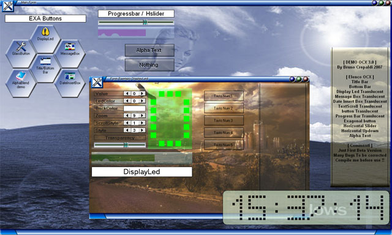



## Demo Ocx 3\.0

### Description

somes Usercontrols first beta version (Firsr Patche)

TitleBar,BottomBar,AlphaText,DisplayLed,Exabutton,

GlassButton,H_Updown,H_slider,Progressbar,TextScroll,

MessageBox,DateInsertBox

Thanks to Roger Gilchrist for his Help.
 
### More Info
 

             |
---                |---
**Submitted On**   |2007-11-05 13:20:16
**By**             |[Bruno crepaldi](https://github.com/Planet-Source-Code/PSCIndex/blob/master/ByAuthor/bruno-crepaldi.md)
**Level**          |Intermediate
**User Rating**    |4.9 (64 globes from 13 users)
**Compatibility**  |VB 6\.0
**Category**       |[OLE/ COM/ DCOM/ Active\-X](https://github.com/Planet-Source-Code/PSCIndex/blob/master/ByCategory/ole-com-dcom-active-x__1-29.md)
**World**          |[Visual Basic](https://github.com/Planet-Source-Code/PSCIndex/blob/master/ByWorld/visual-basic.md)
**Archive File**   |[Demo\_Ocx\_32089811172007\.zip](https://github.com/Planet-Source-Code/bruno-crepaldi-demo-ocx-3-0__1-69584/archive/master.zip)

